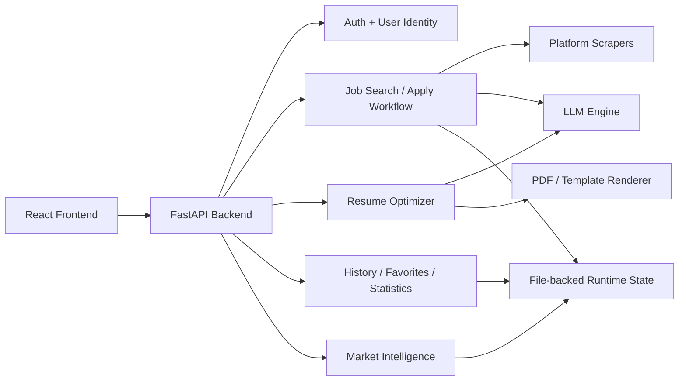
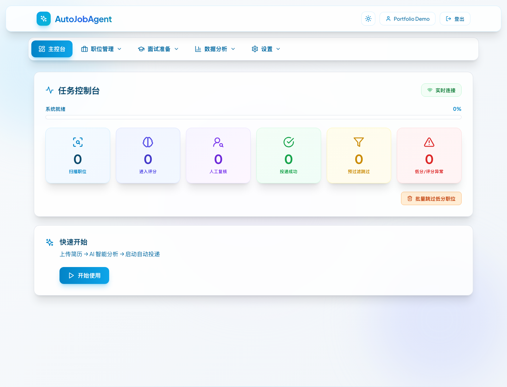
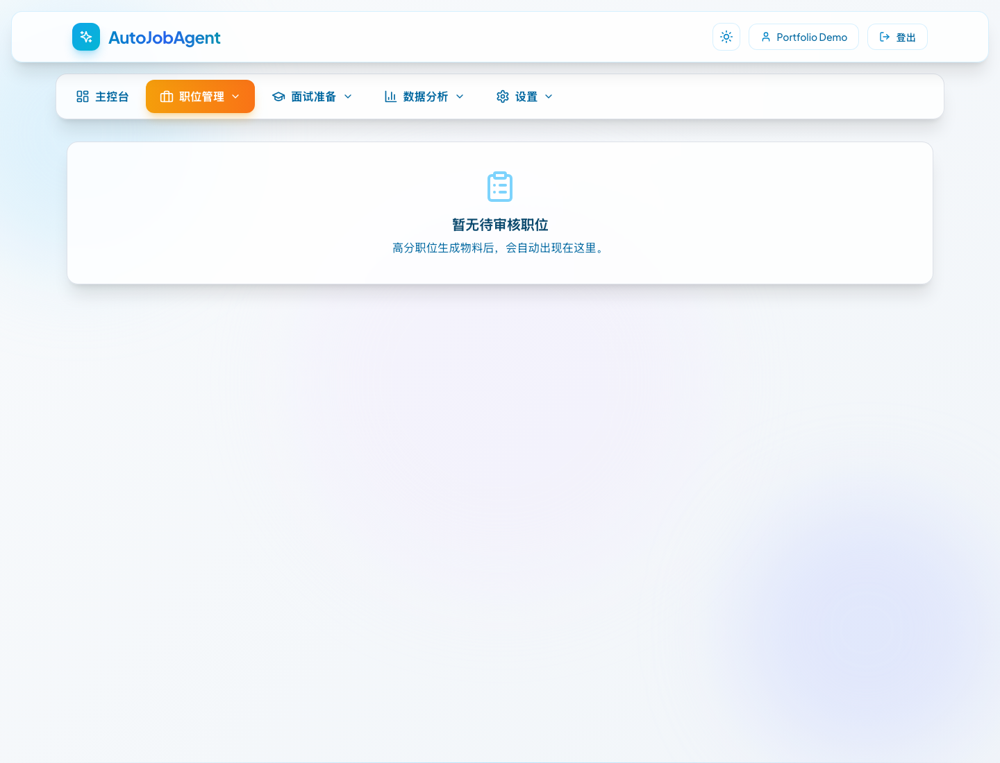
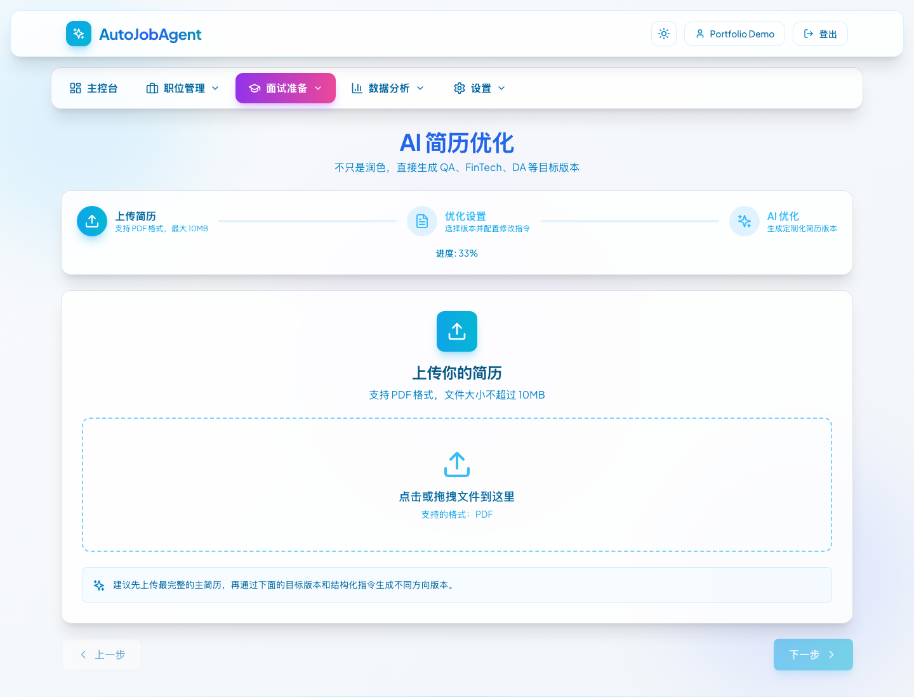
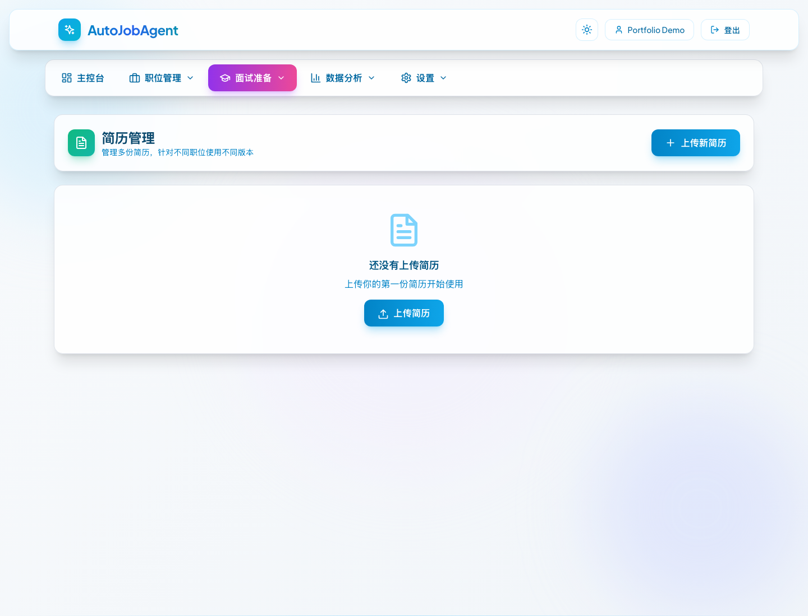
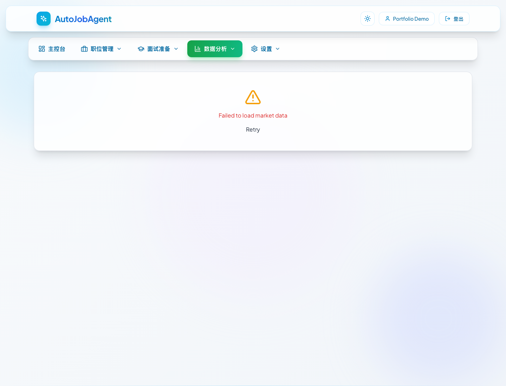

# AutoJobAgent

AI-assisted job application platform for resume tailoring, job discovery, manual-review workflows, and application material generation.

## Portfolio Snapshot

- Full-stack AI workflow product built with `FastAPI`, `React`, `TypeScript`, browser automation, and LLM-based orchestration
- Designed for real-world reliability, with deterministic fallback extraction, human-in-the-loop review, and observable task progress
- Strong portfolio example for `AI Engineer`, `Applied AI`, `Agentic AI`, and workflow automation roles

## Why This Project Matters

Most AI demos stop at text generation. This project focuses on the harder problem: turning a messy business workflow into a usable product with clear state, failure handling, review points, and downloadable outputs.

The system is designed to show:

- how LLM behavior can be wrapped in deterministic safeguards
- how automation and human review can coexist in one workflow
- how a multi-step AI application can be presented as a real product instead of a notebook demo

This repository is the product codebase for a full-stack job search system built around three core ideas:

- Resume-first automation: upload a base resume, analyze it, tailor it per role, and generate downloadable materials.
- Human-in-the-loop control: the system can auto-score and prepare applications, but still stops for manual review on borderline decisions.
- Portfolio-grade observability: users can track task progress, inspect generated files, review history, and analyze the market from accumulated job data.

## What The Product Does

### 1. Job search and application workflow
- Upload a resume and optional supporting data.
- Generate search keywords and filtering rules from resume content.
- Search roles across supported sources and score them against the candidate profile.
- Route high-confidence roles to automation and borderline roles to manual review.
- Generate tailored resumes and cover letters for each selected role.

### 2. Resume optimization workspace
- Upload an existing PDF resume and optimize it into a cleaner ATS-friendly version.
- Create targeted variants such as `general`, `QA`, `FinTech`, and `DA`.
- Apply structured edit instructions such as `delete`, `add`, and `modify`.
- Save generated resume variants into a resume library for later reuse.

### 3. Candidate operating system
- Resume library with labels and default version management.
- Application history, favorites, statistics, and candidate support pages.
- Real-time WebSocket task updates and manual-review actions.
- Market intelligence views built from collected job history.

## Core Features

- Resume upload, parsing, and profile extraction
- AI-powered keyword generation and job-fit scoring
- Tailored resume and cover letter generation
- Multi-step resume optimizer with structured edit instructions
- Manual review queue for borderline job decisions
- Multi-resume management with saved variants
- Task history, favorites, and summary statistics
- Candidate-support utilities
- Market intelligence dashboards over collected jobs
- Real-time task status updates via WebSocket

## Portfolio Highlights

- End-to-end AI application design: resume analysis, job matching, material generation, and operator review
- Prompt-driven workflow logic with structured output recovery and fallback parsing
- Browser automation and scraping integrated into a product workflow
- Human-in-the-loop control for borderline decisions instead of blind automation
- Product-facing frontend for observability, review, and workflow management

## Architecture

### Backend
- `FastAPI` API server with modular route groups in `backend/api/v1/`
- Background job orchestration in `backend/api/v1/jobs.py`
- Authentication, token signing, and user identity management
- Status tracking, history management, material generation, and market analytics

### Frontend
- `React + TypeScript + Vite` SPA in `frontend/src/`
- Protected app shell with pages for dashboard, optimizer, resume manager, history, statistics, favorites, candidate-support tools, and market intelligence
- WebSocket-driven task console on the dashboard

### AI / Automation Layer
- LLM orchestration in `core/llm/engine.py`
- Resume optimization and structured fallback extraction
- Browser automation and platform-specific scraping in `core/`
- PDF rendering through HTML templates in `data/templates/`

## System Diagram



## Demo Gallery

The screenshots below come from the local portfolio demo flow and are redacted for public sharing.

| View | What to show | Suggested file |
| --- | --- | --- |
| Dashboard | Task console, live progress, and review entry points | `assets/screenshots/dashboard-task-console.png` |
| Manual Review | Borderline decision flow plus generated materials | `assets/screenshots/manual-review-card.png` |
| Resume Optimizer | Structured `add / modify / delete` editing flow | `assets/screenshots/resume-optimizer.png` |
| Resume Library | Saved variants and default resume management | `assets/screenshots/resume-library.png` |
| Market Intelligence | Skills or trend analysis page | `assets/screenshots/market-intelligence.png` |

Capture and redaction guidance lives in `assets/screenshots/README.md`.

Recommended sharing order:

1. Dashboard
2. Manual review
3. Resume optimizer
4. Resume library
5. Market intelligence

### Dashboard



### Manual Review



### Resume Optimizer



### Resume Library



### Market Intelligence



## Notable Engineering Decisions

- Resume optimization is not prompt-only. The backend now combines LLM output with deterministic fallback extraction for contact info, work eligibility, languages, education, projects, and skills.
- Manual review is a first-class workflow, not an afterthought. The dashboard exposes job-level decisions and downloadable generated files.
- Runtime state is file-backed for progress, history, and automation status, which keeps local development simple and inspectable.
- The resume optimizer supports structured `add / modify / delete` instructions instead of relying only on free-form notes.

## Repository Layout

```text
backend/                 FastAPI application, route handlers, middleware
core/                    Automation, LLM, PDF, scraping, status, history, auth logic
frontend/                React app and client-side API integrations
data/templates/          HTML templates for generated resumes and cover letters
tests/                   Automated tests and supporting checks
```

## Local Development

### Requirements
- Python 3.10+
- Node.js 18+
- Chromium / Playwright dependencies

### Backend
```bash
python -m venv venv
source venv/bin/activate
pip install -r requirements.txt
playwright install chromium
uvicorn backend.main:app --host 0.0.0.0 --port 8000 --reload
```

### Frontend
```bash
cd frontend
npm install
npm run dev
```

Open:

- Frontend: `http://localhost:5173`
- API docs: `http://localhost:8000/docs`

## Environment Setup

```bash
cp .env.example .env
```

Minimum variables to set:

```env
JWT_SECRET=replace-with-a-long-random-secret
GOOGLE_API_KEY=your-google-gemini-api-key
LLM_MODEL=gemini-3-flash-preview
```

## Public Repository Notes

This repository is intended to be shared as a portfolio project. Real user data, generated resumes, job application outputs, browser profiles, secrets, and local state are intentionally excluded from version control.

If you are creating a public GitHub repository from a previously used private/local repo:

1. Do not push historical commits that contain `.env`, databases, resumes, or generated outputs.
2. Use a fresh repository or a clean orphan branch.
3. Rotate any API keys or secrets that were ever tracked locally.

Additional public-sharing materials:

- `PUBLIC_REPO_CHECKLIST.md` for final pre-push verification
- `GITHUB_SHOWCASE_COPY.md` for GitHub description, LinkedIn copy, and public project summary
- `PROJECT_PRESENTATION_GUIDE.md` for a concise public project overview

This repository is best viewed as a working full-stack product prototype focused on workflow depth, reliability, and applied AI product engineering rather than polished SaaS deployment.
